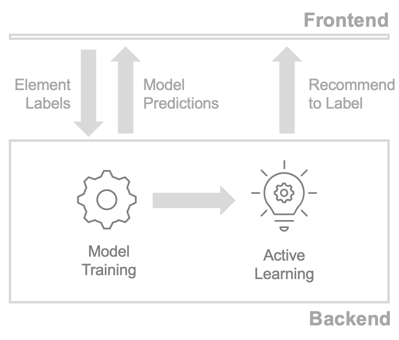

# Architecture

This section provides an overview of the system architecture and the underlying algorithms. 

:::{note}
This section is targetted to readers who want to understand the inner workings of the system. However, use of the system does not require knowledge of these details. For instructions on how to use Label Sleuth, refer to the system [tutorial](../tutorial.md).
:::

## Flow

    

In Label Sleuth the end-to-end model creation process consists of the following steps:

1. **Annotation:** The user starts by using the system's frontend to annotate elements. During this process, element annotations are transmitted to the system's backend.
2. **Model Training:** Periodically, Label Sleuth's backend uses the user-provided annotations to train a machine learning model. Once a model is trained, the predictions of the model are surfaced on the frontend for the user to inspect. For more information about when a model is trained, how the training dataset is created, and what type of model is used, refer to the [model training](model_training.md) documentation.
3. **Active Learning:** When a model is trained, its predictions are fed into an active learning module. The active learning module is responsible for deciding which elements to suggest to the user to annotate next. For more information about the active learning techniques used, refer to the [active learning](active_learning.md) documentation.

This flow is repeated multiple times with the user providing annotations and the system training new versions of the model and providing updated active learning suggestions.